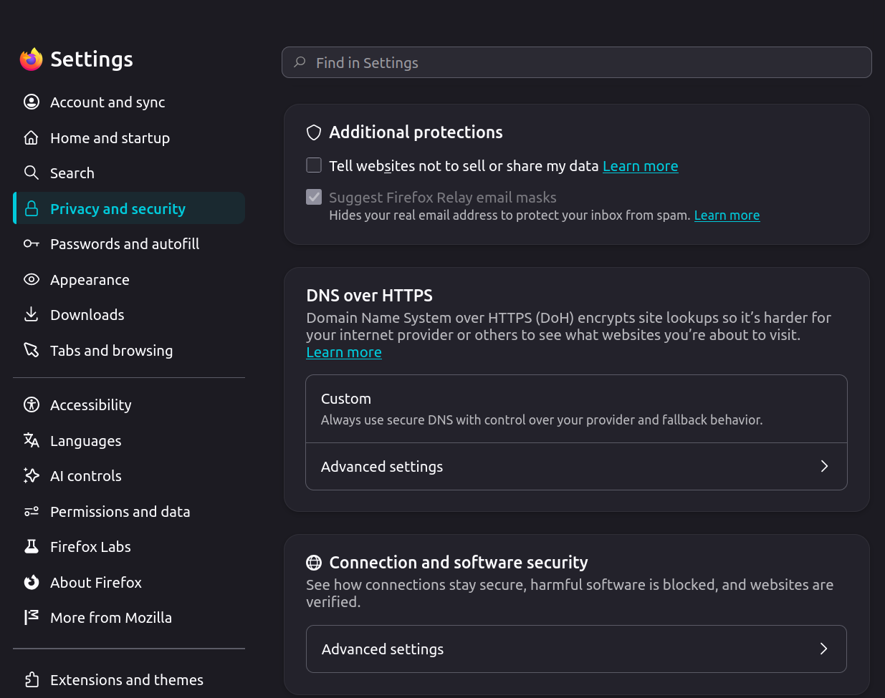
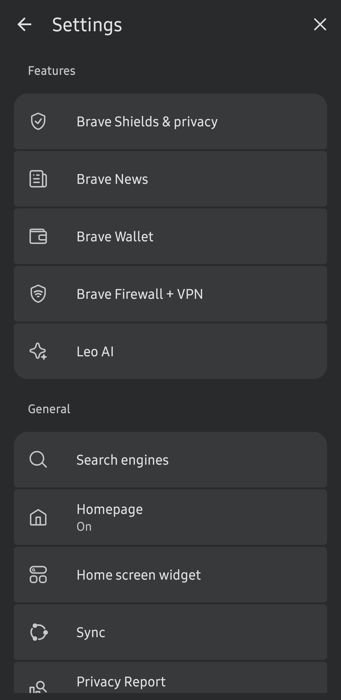
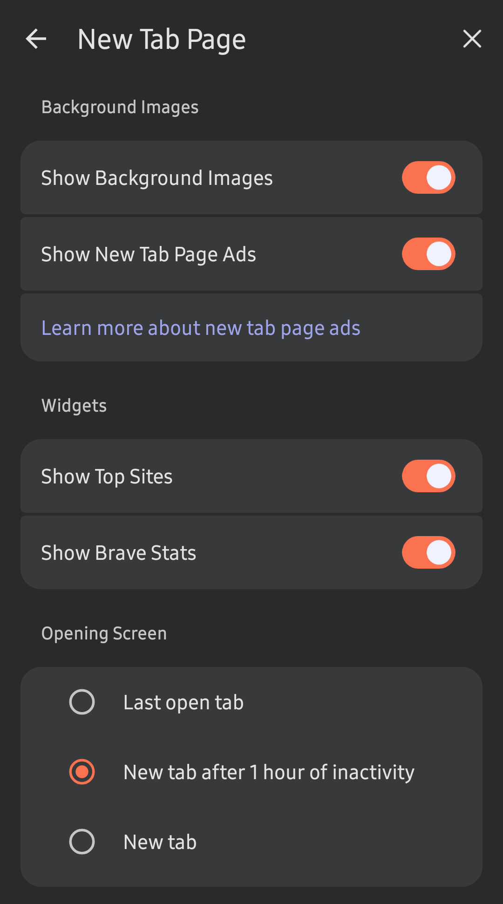

# CONTRIBUTING

- All changes should be based on the current stable version & not pre-release or development builds.
- Add settings related only to privacy/security. Don't include quality, UI, or other changes.
- Use `##` (two `#`) for sections & `####` (four `#`) for subsections. Try to avoid `###` (three `#`) unless absolutely necessary. The size difference between `##` (two `#`) and `####` (four `#`) is much more noticeable when rendered.
    - Unrendered:
        ```
        ## Search
    
        #### Default search engine

        #### Search engine suggestions


        ## Privacy and security

        #### Enhanced Tracking Protection

        #### Additional protections
        ```
    - Rendered:
        > ## Search
        > #### Default search engine
        > #### Search engine suggestions
        >
        > ## Privacy and security
        > #### Enhanced Tracking Protection
        > #### Additional protections
- Keep blank lines exactly as they are. Add 3 blank lines after each section ends and 1 empty line after each subsection ends. These blank lines help me while navigating and editing the files, even though they don't visually make a difference when rendered. Example:
    ```
    ## Search
    
    #### Default search engine

    #### Search engine suggestions


    ## Privacy and security

    #### Enhanced Tracking Protection

    #### Additional protections
    ```
- Decide what should be a section vs subsection based on the UI. Sections are usually the first level of clicks/taps (usually, but not always), while subsections can vary. Sometimes subsections appear in small font that users skip over, or they might not be needed if the settings are clear enough to list as bullet points. Check the examples below:
    - Firefox Desktop:

        

        > ## Home and startup
        > #### Firefox Home
        > - Stories: Off
        >
        > ## Privacy and security
        > #### Additional protections
        > - Tell websites not to sell or share my data: Off
        > #### DNS over HTTPS
        > - Advanced settings >
        >   - Custom
        >       - Choose provider: NextDNS
        > #### Connection and software security
        > - Advanced settings >
        >   - HTTPS-Only Mode: Enable HTTPS-Only Mode in all windows
    - Brave Browser Mobile:

         

        > ## Brave shields & privacy
        > - Block trackers and ads: Block trackers & ads (Aggressive)
        > - Auto-redirect AMP pages: On
        >
        > ## Leo AI
        > - Store my conversation history: Off
        >
        > ## New Tab Page
        > - Show New Tab Page Ads: Off
        > - Show Top Sites: Off
- Don't use GitHub's `> [!NOTE]` or `> [!TIP]` blocks since they don't support indentation. Use this custom format instead:
    - Note:
        ```
        >  **Note**
        >
        > Add the note content here
        ```
    - Tip:
        ```
        >  **tip**
        >
        > Add the tip content here
        ```