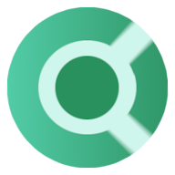

## Contents
- [Privacy Settings](#privacy-settings)
- [Extension Settings](#extension-settings)
- [Changelog](#changelog)
- [FAQs](#faqs)
- [Privacy Best Practices](#privacy-best-practices)
- [Additional Resources](#additional-resources)
  - [Recommendations, alternatives & reviews](#recommendations-alternatives--reviews)
  - [Privacy news, blogs, guides & other stuff](#privacy-news-blogs-guides--other-stuff)
- [Contributing](#contributing)
- [License](#license)

## Privacy Settings

| Name | Version  (If Applicable) |
| --- | -- |
|  [Amazon](https://github.com/the-weird-aquarian/privacy-settings/blob/main/Privacy%20Settings/Amazon.md) | - |
|  [Android 10](https://github.com/the-weird-aquarian/privacy-settings/blob/main/Privacy%20Settings/Android-10.md) | 10 (Q) |
|  [Android 11](https://github.com/the-weird-aquarian/privacy-settings/blob/main/Privacy%20Settings/Android-11.md) | 11 (R) |
|  [Android 12/12.1](https://github.com/the-weird-aquarian/privacy-settings/blob/main/Privacy%20Settings/Android-12.md) | 12 (S), 12.1 (12L) |
|  [Android 13](https://github.com/the-weird-aquarian/privacy-settings/blob/main/Privacy%20Settings/Android-13.md) | 13 (T) |
|  [Android Studio](https://github.com/the-weird-aquarian/privacy-settings/blob/main/Privacy%20Settings/Android-Studio.md) | - |
|  [Apple ID](https://github.com/the-weird-aquarian/privacy-settings/blob/main/Privacy%20Settings/Apple-ID.md) | - |
|  [Brave Desktop](https://github.com/the-weird-aquarian/privacy-settings/blob/main/Privacy%20Settings/Brave.md) | 1.57.62 |
|  [Brave Mobile](https://github.com/the-weird-aquarian/privacy-settings/blob/main/Privacy%20Settings/Brave-Mobile.md) | 1.57.62 |
|  [Brave Search](https://github.com/the-weird-aquarian/privacy-settings/blob/main/Privacy%20Settings/Brave-Search.md) | - |
|  [ChatGPT](https://github.com/the-weird-aquarian/privacy-settings/blob/main/Privacy%20Settings/ChatGPT.md) | - |
|  [Cromite](https://github.com/the-weird-aquarian/privacy-settings/blob/main/Privacy%20Settings/Cromite.md) | 116.0.5845.180 |
|  [Discord](https://github.com/the-weird-aquarian/privacy-settings/blob/main/Privacy%20Settings/Discord.md) | - |
|  [DuckDuckGo Search](https://github.com/the-weird-aquarian/privacy-settings/blob/main/Privacy%20Settings/DuckDuckGo-Search.md) | - |
|  [Facebook](https://github.com/the-weird-aquarian/privacy-settings/blob/main/Privacy%20Settings/Facebook.md) | - |
|  [Firefox Desktop](https://github.com/the-weird-aquarian/privacy-settings/blob/main/Privacy%20Settings/Firefox.md) | 117.0 |
|  [Firefox Focus](https://github.com/the-weird-aquarian/privacy-settings/blob/main/Privacy%20Settings/Firefox-Focus.md) | 117.0.1 |
|  [Firefox Mobile/Fennec](https://github.com/the-weird-aquarian/privacy-settings/blob/main/Privacy%20Settings/Firefox-Mobile.md) | 117.0.1 |
|  [Gboard](https://github.com/the-weird-aquarian/privacy-settings/blob/main/Privacy%20Settings/Gboard.md) (Google Keyboard) | 13.3.06.551538635 |
|  [Gmail](https://github.com/the-weird-aquarian/privacy-settings/blob/main/Privacy%20Settings/Gmail.md) | - |
|  [Google Account](https://github.com/the-weird-aquarian/privacy-settings/blob/main/Privacy%20Settings/Google-Account.md) | - |
|  [Google Chrome/Ungoogled Chromium Desktop](https://github.com/the-weird-aquarian/privacy-settings/blob/main/Privacy%20Settings/Google-Chrome.md) | 116.0.5845.180 |
|  [Google Chrome/Ungoogled Chromium Mobile](https://github.com/the-weird-aquarian/privacy-settings/blob/main/Privacy%20Settings/Google-Chrome-Mobile.md) | 116.0.5845.172 |
|  [Google Search](https://github.com/the-weird-aquarian/privacy-settings/blob/main/Privacy%20Settings/Google-Search.md) | - |
|  [Instagram](https://github.com/the-weird-aquarian/privacy-settings/blob/main/Privacy%20Settings/Instagram.md) | - |
|  [LinkedIn](https://github.com/the-weird-aquarian/privacy-settings/blob/main/Privacy%20Settings/LinkedIn.md) | - |
|  [Logi Options+](https://github.com/the-weird-aquarian/privacy-settings/blob/main/Privacy%20Settings/Logi-Options%2B.md) | - |
|  [Logitech Options](https://github.com/the-weird-aquarian/privacy-settings/blob/main/Privacy%20Settings/Logitech-Options.md) | - |
|  [Microsoft Edge Desktop](https://github.com/the-weird-aquarian/privacy-settings/blob/main/Privacy%20Settings/Microsoft-Edge.md) | 116.0.1938.76 |
|  [Microsoft Edge Mobile](https://github.com/the-weird-aquarian/privacy-settings/blob/main/Privacy%20Settings/Microsoft-Edge-Mobile.md) | 116.0.1938.75 |
|  [Proton Mail](https://github.com/the-weird-aquarian/privacy-settings/blob/main/Privacy%20Settings/Proton-Mail.md) | - |
|  [Reddit](https://github.com/the-weird-aquarian/privacy-settings/blob/main/Privacy%20Settings/Reddit.md) | - |
|  [Signal](https://github.com/the-weird-aquarian/privacy-settings/blob/main/Privacy%20Settings/Signal.md) | - |
|  [Spotify](https://github.com/the-weird-aquarian/privacy-settings/blob/main/Privacy%20Settings/Spotify.md) | - |
|  [Startpage Search](https://github.com/the-weird-aquarian/privacy-settings/blob/main/Privacy%20Settings/Startpage-Search.md) | - |
|  [Telegram](https://github.com/the-weird-aquarian/privacy-settings/blob/main/Privacy%20Settings/Telegram.md) | - |
|  [Twitter (X)](https://github.com/the-weird-aquarian/privacy-settings/blob/main/Privacy%20Settings/Twitter.md) | - |
|  [Visual Studio Code](https://github.com/the-weird-aquarian/privacy-settings/blob/main/Privacy%20Settings/Visual-Studio-Code.md) | - |
|  [Vivaldi Desktop](https://github.com/the-weird-aquarian/privacy-settings/blob/main/Privacy%20Settings/Vivaldi.md) | 6.1.3035.302 |
|  [Vivaldi Mobile](https://github.com/the-weird-aquarian/privacy-settings/blob/main/Privacy%20Settings/Vivaldi-Mobile.md) | 6.2.3110.52 |
|  [WhatsApp](https://github.com/the-weird-aquarian/privacy-settings/blob/main/Privacy%20Settings/WhatsApp.md) | - |
|  [Windows 10](https://github.com/the-weird-aquarian/privacy-settings/blob/main/Privacy%20Settings/Windows-10.md) | 22H2 (OS Build 19045.3393) |
|  [Windows 11](https://github.com/the-weird-aquarian/privacy-settings/blob/main/Privacy%20Settings/Windows-11.md) | 22H2 (OS Build 22621.2215) |
|  [YouTube](https://github.com/the-weird-aquarian/privacy-settings/blob/main/Privacy%20Settings/YouTube.md) | - |
|  [Zoom](https://github.com/the-weird-aquarian/privacy-settings/blob/main/Privacy%20Settings/Zoom.md) | - |

## Extension Settings
- Download uBlock Origin: [Google Chrome/Chromium based browsers](https://chrome.google.com/webstore/detail/ublock-origin/cjpalhdlnbpafiamejdnhcphjbkeiagm), [Firefox](https://addons.mozilla.org/en-US/firefox/addon/ublock-origin/), [Microsoft Edge](https://microsoftedge.microsoft.com/addons/detail/ublock-origin/odfafepnkmbhccpbejgmiehpchacaeak)
 Also available for Firefox Mobile and Fennec in the `Add-ons`.
- [uBlock Origin settings](https://github.com/the-weird-aquarian/privacy-settings/blob/main/Extensions%20Settings/uBlock-Origin-Settings.md)

## Changelog
Any notable changes will be accounted in the [changelog](https://github.com/the-weird-aquarian/privacy-settings/blob/main/CHANGELOG.md).

## FAQs

#### Will following the settings mentioned here ensure complete privacy?
While following these settings can significantly minimize data collection and tracking by the mentioned services/software, it is important to note that absolute privacy and security on the internet are difficult to achieve. Even with these settings, there may still be some level of data collection or tracking. It is advisable to explore and utilize privacy-respecting alternatives whenever possible for enhanced privacy.

#### Why are privacy invading services like Facebook, Zoom, Google etc. mentioned here? Isn't this repo focused on privacy?
While the aim of this repo is to promote privacy, there may be instances where the use of privacy-invading services/software is necessary. For example, using Zoom for work meetings or a social media platform for business purposes. The goal here is to minimize data collection and enhance digital privacy as much as possible, even when using privacy-invading services/software. However, it is highly encouraged to explore and adopt better privacy-respecting alternatives whenever available and suitable for your needs.

#### The settings for a particular software/service was updated months ago, when will it be updated according to latest version?
Settings for softwares/services may not require frequent updates with each new version. If there have been no significant changes that affect the settings, it will not be updated. If the latest version is mentioned, the settings provided already apply to that version, even if they were last updated months ago.

## Privacy Best Practices
The TL;DR version of best practices for digital privacy:
- Create strong passwords (preferably 10+ characters with a mix of letters, numbers, and special characters).
- Avoid reusing passwords.
- Utilize a password manager to generate and securely store unique passwords.
- Follow the privacy settings recommended here.
- Opt for privacy respecting alternatives for search engines, emails, browsers etc.
- Enable multifactor authentication for added security.
- Keep your apps and operating system updated.
- Use open-source softwares and apps whenever possible (open-source doesn't always necessarily mean secure).
- Regularly review and revoke unnecessary permissions for software and apps.
- Share information sparingly & only provide what is necessary.
- Consider using false information when appropriate (Never knowingly provide false information to legal entities, law enforcement, medical professionals, banks, etc.).
- Utilize End-to-End Encrypted (E2EE) messaging services.
- Encrypt your devices for enhanced security.
- Perform regular backups of your data.
- Educate others and raise awareness about digital privacy. Spread the word!

## Additional Resources
For better privacy respecting alternatives, reviews and more information, check out:

#### Recommendations, alternatives & reviews
- [Privacy Guides](https://www.privacyguides.org)
- [Techlore Resources](https://www.techlore.tech/resources.html)
- [RestorePrivacy](https://restoreprivacy.com/) (Only for reviews, not recommendations)
- [PRISM Break](https://prism-break.org/)
- [Awesome Privacy](https://github.com/pluja/awesome-privacy)
- [Privacy Respecting](https://github.com/nikitavoloboev/privacy-respecting)
- [ThinkPrivacy](https://thinkprivacy.net)

#### Privacy news, blogs, guides & other stuff
- [EFF](https://www.eff.org/)
- [Mozilla Blog](https://blog.mozilla.org/)
- [Spread Privacy](https://spreadprivacy.com/)
- [ProtonMail Blog](https://protonmail.com/blog/)
- Techlore: [Website](https://www.techlore.tech), [GitHub](https://github.com/techlore), [YouTube](https://www.youtube.com/c/Techlore/)
- The New Oil: [Website](https://thenewoil.org/), [YouTube](https://www.youtube.com/c/TheNewOil)
- [The Hitchhiker’s Guide to Online Anonymity](https://anonymousplanet.org/guide.html)
- [The Data Detox Kit](https://datadetoxkit.org)
- [Personal security checklist](https://github.com/Lissy93/personal-security-checklist)
- [Security in a Box](https://securityinabox.org/)
- [CR Security Planner](https://securityplanner.consumerreports.org/)
- [National Cybersecurity Alliance - Stay Safe Online](https://staysafeonline.org/stay-safe-online/)
- [Zebra Crossing: An easy-to-use digital safety checklist](https://github.com/narwhalacademy/zebra-crossing)
- [Privacy Not Included](https://foundation.mozilla.org/en/privacynotincluded/)
- [IVPN Privacy Guides](https://www.ivpn.net/privacy-guides/)
- [r/privacy](https://www.reddit.com/r/privacy/)
- [Access Now Blog](https://www.accessnow.org/blog/)
- [Fossbytes - Security](https://fossbytes.com/category/security/)
- [Bitwarden Blog](https://bitwarden.com/blog/)
- [Bleeping Computer](https://www.bleepingcomputer.com/)
- [The Hacker News](https://thehackernews.com/)

## Contributing
If you want to help out with the project, here are some ideas:

- iOS/macOS privacy settings.
- Clean up/improve the Markdown.
- Suggest new services/softwares or help improve the existing ones.
- Translate it to your own language.
- Anything else related to privacy or security.

Pull requests can be submitted [here](https://github.com/the-weird-aquarian/privacy-settings/pulls).

## License
This project is licensed under the terms of [MIT License](https://github.com/the-weird-aquarian/privacy-settings/blob/main/LICENSE).
